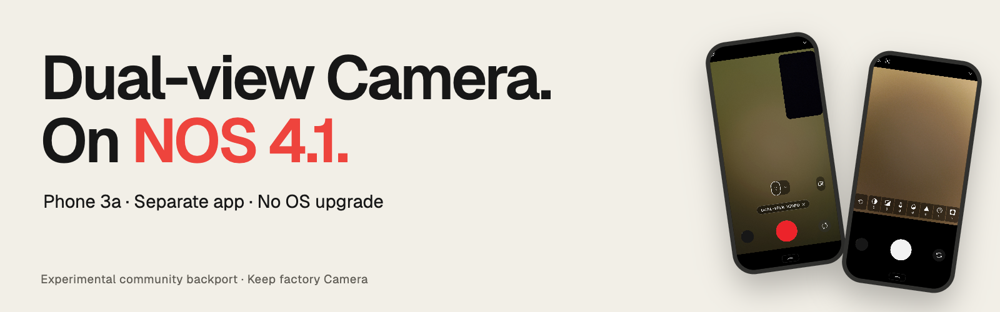
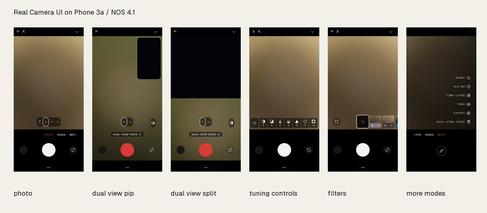

# Nothing Camera port for NOS 4.1

This is a backport of the NOS 5 beta Camera app, adapted to run alongside your stock camera on a Nothing Phone 3a running NOS 4.1. It lets you record with front and rear cameras at the same time, complete with draggable picture-in-picture.

[Download r12 APK](https://github.com/anxkhn/nothing-camera-backport/releases/download/r12/Nothing-Camera-Beta-Port-17.0.00.71.00-r12-galleryid-signed.apk) · [Release page](https://github.com/anxkhn/nothing-camera-backport/releases/tag/r12) · [Installation guide](docs/INSTALL.md) · [Build from source](docs/BUILD.md) · [Technical write-up](docs/THIRD_PARTY_PROCESSING.md)

This is an independent community project and is not affiliated with or supported by Nothing.

## Quick install

1. Download the APK and open it on your phone.
2. Allow installation from your browser or file manager when prompted.
3. Grant permissions for camera, microphone, and media access.
4. Open **Nothing Camera Beta Port**.

Leave your original Nothing Camera installed and enabled. This port connects to its background service to process photos. You do not need root, a PC, or an OS update.

## Tested hardware and OS

| Component | Version |
| --- | --- |
| Phone | Nothing Phone 3a (A059, AsteroidsIND) |
| OS | Nothing OS 4.1 (Android 16, B4.1-260810-1153) |
| Stock Camera | 16.0.01.27.00 |
| Ported app | 17.0.00.71.00 (Asteroids-C5.0-260915-2123) |
| Package name | com.anx.camera.experimental |

What was verified on this device:
- Dual-view video: records front and rear cameras into a single 1080p MP4 (1080 × 1920, H.264 at ~30 fps) with stereo AAC audio.
- Draggable picture-in-picture: you can drag the inset preview window anywhere on screen, tap to swap the main camera, or switch to a 50/50 split-screen.
- Photo capture: saves full-resolution rear (3072 × 4080) and front (4928 × 6560) JPEGs through the factory backend.
- Gallery integration: opens Google Photos or Nothing Gallery normally after capture.

For test logs and measurements, see [device verification](docs/DEVICE_VERIFICATION.md).

## What to know before installing

- Other phone models and OS builds have not been tested.
- This port brings the new app interface and dual-view recording, but it does not bring NOS 5 image-processing algorithms. Low-level tuning still comes from your NOS 4.1 firmware.
- Portrait mode, high-resolution burst captures, and extended video sessions have not been tested in detail.
- Do not run the stock camera and this port at the same time. The background processing service only handles one camera app at a time.

## Documentation and source kit

Check out the [real Camera UI gallery](assets/screenshots/README.md) for full-resolution screenshots of the app running on the Phone 3a, and [UI banners](assets/ui-banners/README.md) for shareable graphics.

This repository contains the complete reconstruction kit: smali patches, Binder compatibility adapters, build scripts, and input hashes. No proprietary blobs or private keys are stored in the repo; the build scripts fetch and patch them during the build process.

A clean rebuild from stock inputs matches every non-signing entry in the r12 APK byte for byte. See the [validation record](provenance/validation.json).

| Document | Description |
| --- | --- |
| [Installation](docs/INSTALL.md) | Setup steps, permissions, and troubleshooting |
| [Firmware extraction](docs/EXTRACTION.md) | Pulling factory APKs and libraries from firmware images |
| [Build instructions](docs/BUILD.md) | Compiling, patching, and verifying the APK from source |
| [Third-party processing](docs/THIRD_PARTY_PROCESSING.md) | Binder IPC bridge, metadata buffers, and file ownership |
| [Technical findings](docs/TECHNICAL_FINDINGS.md) | Compatibility blockers discovered and how they were solved |
| [Reference files](docs/REFERENCE_FILES.md) | Source references and smali reconstruction maps |
| [File map](docs/FILE_MAP.md) | Complete directory and script index |
| [Artwork](assets/README.md) | Posters, headers, and infographics |

## Credits and license

The original Camera application and device firmware are the property of Nothing Technology Limited. Firmware archive references come from [spike0en/nothing_archive](https://github.com/spike0en/nothing_archive) and [Nothing Archive](https://nothingarchive.tech/). Metadata compatibility relies on [AndroidHiddenApiBypass](https://github.com/LSPosed/AndroidHiddenApiBypass) (Apache-2.0). Artwork typography uses Geist under the SIL Open Font License 1.1.

Authored scripts, patches, adapters, tests, and original artwork are licensed under the [MIT License](LICENSE). This license does not apply to OEM binaries, extracted firmware libraries, or decompiled code. See [licensing scope](licenses/SCOPE.md).

## Feedback

If you run into issues, open a GitHub issue with your phone model, exact OS build number, stock Camera version, and steps to reproduce. Test whether photos actually save to your gallery, rather than only checking if the viewfinder opens. Strip personal info from any logcat dumps before posting.
